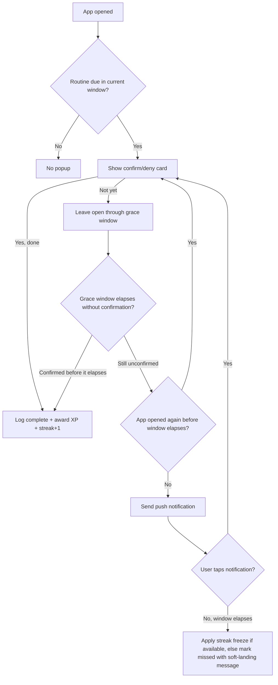

# Gamifying Belific's Routines: A Research-Backed Design Doc

*Prepared for Jethro — August 21, 2026*

## Why this document exists

You want Belific's Routines section to feel the way Mobile Legends feels when you're on a winning streak — pulling you back in, making progress visible, making "just one more" genuinely rewarding — but without the part where three hours disappear and you feel worse afterward. That's a real and well-studied design problem: the same psychological levers that make MOBAs and mobile games compelling (progression, streaks, variable rewards, social pressure) are the same levers that responsible habit apps like Duolingo and Habitica use to build consistency. The difference isn't the mechanic, it's how it's tuned. This doc walks through what the research says about why those mechanics work, what specifically separates "engaging" from "exploitative," and then translates that into a concrete design for Belific: streaks on routines, an auto-popup check-in when you open the app, a notification fallback when you don't, and an XP/leveling system tied to consistency rather than time-on-app.

## Part 1 — What actually drives engagement, and where it turns unhealthy

### Streaks run on loss aversion, not just motivation

The single strongest force behind streak mechanics is loss aversion: people feel the pain of losing something roughly twice as intensely as the pleasure of gaining something equivalent. Once someone has a 40-day streak, the thing keeping them showing up often isn't excitement about the routine anymore — it's not wanting to lose the 40 days. Smashing Magazine's design breakdown of streak systems frames this directly: a well-designed streak becomes "who they are, not just what they do," and that's exactly the line between healthy consistency and anxiety-driven compulsion. The same piece points to BJ Fogg's Behavior Model (B = Motivation × Ability × Prompt) as the reason streaks need to pair with *low-friction* actions — Duolingo's minimum unit is one lesson, Apple Fitness's is one minute of standing, because motivation is unreliable but a small enough action survives a bad day. There's also the Zeigarnik effect at work — unfinished, ongoing things occupy more mental space than completed ones, which is part of why an open streak nags at you until you close the loop for the day ([Smashing Magazine](https://www.smashingmagazine.com/2026/02/designing-streak-system-ux-psychology/)).

Duolingo's own data on this is a useful proof point: users with access to a "streak freeze" (a way to protect a streak through a missed day) averaged 17.19 days of streak length versus 11.62 days for users without one — a 48% improvement. Their achievement system shows the same pattern from a different angle: users who complete an achievement on day one retain at 33.42%, versus 20.36% for users who don't ([Trophy.so Duolingo case study](https://trophy.so/blog/duolingo-gamification-case-study)). The pattern across both numbers is the same: a *forgiving* system that lets people recover from a slip keeps them in the game far better than a strict one that resets to zero.

### Variable rewards are the part you should mostly avoid

This is the mechanic most directly responsible for why MOBAs and gacha-style mobile games are so hard to put down. When an action's payoff is unpredictable — a rare drop, a clutch win, a lucky pull — the brain's dopamine system responds more strongly to the *anticipation* of an uncertain reward than to a reliable one, which is the same reinforcement schedule that makes slot machines compelling ([Medium — psychology of game addiction](https://medium.com/@luc_chaoui/understanding-game-design-the-psychology-of-addiction-41128565305f); [Unplugged Psych — variable rewards](https://www.unpluggedpsych.com/the-addictive-power-of-variable-rewards/)). It's genuinely effective at driving compulsive return visits, which is precisely why it's the mechanic to deliberately leave out of Belific. The ethical-gamification literature is blunt about this trade-off: ground rewards in mastery and visible progress (predictable, transparent XP for real actions) rather than in gambling-style variable payouts, because the latter optimizes for time-on-app instead of the user's actual goal ([Gamification Hub — 5 ethical principles](https://www.gamificationhub.org/ethical-gamification-principles/)).

### Self-determination theory: what makes progression systems motivating instead of hollow

Self-Determination Theory (SDT) explains why some point-and-badge systems feel meaningful and others feel like busywork. Intrinsic motivation is sustained by three needs: competence (feeling capable and improving), autonomy (having real choice and control), and relatedness (feeling connected to others). Gamification that only adds extrinsic rewards on top of a task — points for points' sake — tends to produce a short-lived behavior change that evaporates once the reward stops, whereas systems that visibly reflect *skill growth*, let the user choose their own goals, and connect them to other people sustain motivation much longer ([Medium — gamification and SDT](https://medium.com/@samkenyon/gamification-and-self-determination-theory-45a28494b672)). This is the main argument for why Belific's XP should be earned from the user's *own* routines (autonomy), should visibly compound into levels that reflect real consistency (competence), and should have an optional social layer later (relatedness) — rather than being a generic points counter bolted on top.

### What the case studies (Duolingo, Habitica) actually did

Duolingo layers several systems that hit different users at different points: XP as a single unified currency across all activities; streaks with freeze protection; customizable daily goals (5–20 minutes) so the bar for "keeping the streak" is realistic; achievements split into immediate day-one wins versus longer-tier awards; and small weekly leagues of about 30 users (not global leaderboards) with promotion/demotion, which motivates both climbing and not sliding back. This layered approach is credited as part of how they grew from 5 million to 40 million daily active users between 2020 and 2024 ([Trophy.so](https://trophy.so/blog/duolingo-gamification-case-study)).

Habitica takes the RPG framing further: tasks split into Habits (repeatable), Dailies (recurring), and To-Dos (one-off), all feeding a single XP/level track. It adds a consequence for *neglect*, not just a reward for completion — skipping dailies drains a Health Points bar, and hitting zero HP has a real penalty (lost gold and XP) — which is an interesting mechanic but one to use carefully, since it converts "I didn't do my routine" into a punishment rather than a neutral miss. Notably, Habitica deliberately has no public leaderboards; its social layer is cooperative party quests instead, specifically to get relatedness without competitive pressure ([Trophy.so](https://trophy.so/blog/habitica-gamification-case-study)).

### The line between "engaging" and "dark pattern"

The clearest framing comes from the ethical-gamification literature, which converges on five principles worth adopting wholesale for Belific: autonomy (real control over engagement, not coercion), transparency (the user can see exactly how XP/streaks are calculated), well-being prioritized over raw time-on-app as the success metric, fairness (no pay-to-win, no predatory loops), and privacy (minimal data collection) ([Gamification Hub](https://www.gamificationhub.org/ethical-gamification-principles/)). Concretely, that means: streaks need off-ramps (freezes, grace windows) instead of hard resets; notification copy should read as a helpful nudge ("your evening routine is ready") rather than manufactured urgency ("your streak is about to die!!"); and rewards should scale with real actions taken, never with money spent or with pure luck.

## Part 2 — The Belific design

### 2.1 Streaks on Routines

Each routine (or the Routines section as a whole, if you want a single unified streak — see the open question at the end) tracks a streak counter that increments once per completed check-in per day, using the user's local timezone to define "day," not server time. Given the research above, the streak system should ship with three protections from day one rather than as a later patch:

A **streak freeze** — one or two "banked" freezes a user can earn (e.g., one per 7-day streak milestone) that auto-apply to a missed day instead of breaking the streak. A **grace window** of 2–3 hours past a routine's deadline before it's marked missed, to absorb normal life friction (meetings running over, phone on silent). And if a streak does break, a **soft landing** rather than a hard reset to zero: show the user what they built ("You showed up 42 days straight — that's real. Want to start today?") instead of a bare "Streak lost." This isn't just kindness for its own sake — Duolingo's freeze data (17.19 vs. 11.62 average days) shows forgiving streaks measurably outperform punishing ones at the thing you actually care about, which is people coming back.

Milestones deserve their own small celebration beat — day 7, 30, 50, 100, 365 are the conventional checkpoints — with a distinct animation or a small XP bonus, since these are the moments that re-anchor emotional investment in the streak.

### 2.2 The auto-popup check-in

When the user opens Belific, the app checks whether there are routines due in the current or a recently-elapsed timeframe. If so, it surfaces a lightweight confirm/deny prompt — not a full-screen interruption, more like a card or modal the user can dismiss with a single tap: "Did you do your morning routine? [Yes] [Not yet]." Confirming logs the completion, increments the streak, and awards XP immediately (immediate feedback matters — Duolingo's XP system works partly because the reward lands right after the action, not at the end of the day). "Not yet" doesn't break anything by itself; it just leaves the routine open through the grace window, and if the window lapses without a "Yes," *then* the streak logic above kicks in (freeze, if available, or a miss).

The state machine looks roughly like this:

### 2.3 The notification fallback

If the check-in window is about to lapse and the app hasn't been opened, that's when the push notification fires — not before, and not repeatedly. A few things the notification research points to directly: timing should be tied to the routine's own scheduled window (morning routines get morning-window notifications; the research on fitness-app timing specifically found 7–8am performs best for that category, while productivity-type actions do better around midday) rather than one global send time for all users. "Intelligent timing" — sending based on a given user's own historical open patterns rather than a fixed clock time — measured 2.6x more effective at driving opens than static scheduling in Braze's analysis, so if Belific has enough usage data per user, adapting the send time per-person is worth building toward even if v1 ships with routine-window-based timing ([Braze](https://www.braze.com/resources/articles/push-notifications-best-practices)).

Copy matters as much as timing. The ethical-gamification guidance is specific here: frame it as a positive nudge ("Your evening routine is ready when you are") rather than manufactured urgency ("Your streak breaks in 20 minutes!!"). Tapping the notification should deep-link straight into the same confirm/deny card, not dump the user on the app's home screen. And notifications need a frequency ceiling and quiet hours — the same research that shows push notifications can lift engagement by up to 191% also shows that over-sending is what drives opt-outs and uninstalls, so this should be capped per routine per day (one nudge, not a chain of reminders) with an easy in-app way to adjust or mute it, and permission should be earned with a short explanation of the value before the OS prompt fires, not requested cold on first launch.

### 2.4 XP and leveling

Every completed routine or task awards a base amount of XP, with two additive bonuses layered on top: a small streak bonus that scales with the current streak length (rewarding consistency, not just the one action) and a one-time milestone bonus at the day-7/30/50/100/365 checkpoints. This keeps the reward predictable and transparent — the user can always see exactly why they got the XP they got, which is the "transparency" principle from the ethics research, and deliberately avoids anything resembling a loot box or random-payout mechanic.

For the level curve itself, the RPG design literature lays out three standard shapes — linear (flat XP requirement per level), exponential/quadratic (each level costs meaningfully more than the last), and logarithmic (early levels are fast, then it flattens) ([Davide Aversa — RPG progression math](https://www.davideaversa.it/blog/gamedesign-math-rpg-level-based-progression/)). For a habit app specifically, a hybrid is the better fit than any single pure curve: fast early levels (roughly logarithmic for the first 5–10 levels) so a brand-new user hits Level 2 or 3 within their first week — this matters because early wins are what get someone through the fragile first stretch of habit formation — and then a slower, more exponential curve at higher levels so the system still has meaningful long-term headroom for your most consistent users instead of everyone maxing out in a month. A reasonable starting formula is XP-to-next-level ≈ base × level^1.5, which naturally produces that fast-then-slowing shape without needing two separate formulas stitched together.

One naming note: the level should represent *consistency*, not "productivity" as a judged score. If Belific frames the number as a "Productivity Level," it risks implying the app is grading the user's worth as a productive person, which cuts against the well-being-first principle. Framing it as something like a streak/momentum level ("Level 6 — Consistency" or similar) keeps the same motivational effect — visible growth, competence signal — without turning a missed day into a verdict on the user.

### 2.5 Guardrails — the part that makes this Belific and not Mobile Legends

Given that avoiding the addictive downside was your explicit starting point, these aren't optional polish, they're core to the spec: no variable/random XP rewards anywhere in the system; a visible, one-tap "pause" or vacation mode that freezes streak decay without penalty for real breaks (illness, travel); a hard cap on notification frequency with user-adjustable quiet hours; streak-break messaging that's always encouraging, never guilt-based; and — if you build any social or leaderboard layer later — default to small private groups or opt-in only, never a public global ranking, since that's the single feature most associated with compulsive competitive engagement in both Duolingo's league design and the broader dark-patterns literature. Worth also deciding up front what success looks like for you: if the metric you optimize for is daily-active-minutes, you'll eventually be pulled back toward Mobile-Legends-style mechanics by the numbers themselves; if it's routine completion rate and streak health, the system stays aligned with what you actually wanted to build.

### 2.6 Open questions worth deciding before building

Whether each individual routine gets its own streak or the whole Routines section shares one combined streak changes the emotional stakes a lot — per-routine streaks are more granular and forgiving (missing your reading routine doesn't touch your workout streak) but more complex to surface in one glance; a single combined streak is simpler and punchier but means one missed routine can feel like it tanks everything. Also worth deciding: whether HP-style penalties (à la Habitica) belong in Belific at all, or whether sticking to positive-only reinforcement (XP for doing, nothing for not doing, rather than a health bar that drains) fits your well-being goal better — the research doesn't say penalties don't work, only that they trade some retention for some added anxiety, so it's a values call rather than a data-driven one.

## References

- [Designing A Streak System: The UX And Psychology Of Streaks — Smashing Magazine](https://www.smashingmagazine.com/2026/02/designing-streak-system-ux-psychology/)
- [Duolingo Gamification Strategy: A Full Case Study — Trophy.so](https://trophy.so/blog/duolingo-gamification-case-study)
- [Habitica's Gamification Strategy: A Case Study — Trophy.so](https://trophy.so/blog/habitica-gamification-case-study)
- [Gamification and Self-Determination Theory — Sam Kenyon, Medium](https://medium.com/@samkenyon/gamification-and-self-determination-theory-45a28494b672)
- [5 Ethical Gamification Principles for Human-Centric Design — Gamification Hub](https://www.gamificationhub.org/ethical-gamification-principles/)
- [A Guide To Push Notification Best Practices — Braze](https://www.braze.com/resources/articles/push-notifications-best-practices)
- [Understanding Game Design: The Psychology of Addiction — Luc Chaoui, Medium](https://medium.com/@luc_chaoui/understanding-game-design-the-psychology-of-addiction-41128565305f)
- [The Addictive Power of Variable Rewards — Unplugged Psych](https://www.unpluggedpsych.com/the-addictive-power-of-variable-rewards/)
- [GameDesign Math: RPG Level-based Progression — Davide Aversa](https://www.davideaversa.it/blog/gamedesign-math-rpg-level-based-progression/)
